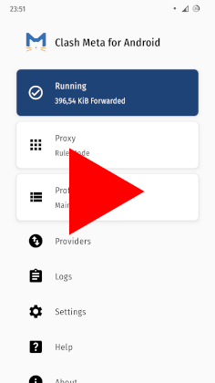
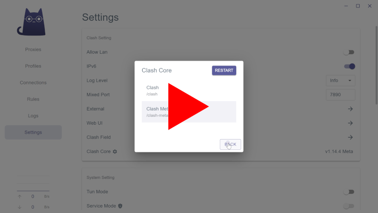

<p align="right">English | <a href="README.ru.md">Русский</a></p>

## Clash

### Android

Recommended app: [Clash Meta for Android](https://github.com/MetaCubeX/ClashMetaForAndroid)


#### Installation

I recommend to install with [F-Droid](https://f-droid.org) / [Neo Store](https://f-droid.org/packages/com.machiav3lli.fdroid) — this will make updating easier. You can also install manually.

- [Clash Meta on F-Droid / Neo Store](https://f-droid.org/packages/com.github.metacubex.clash.meta)

- [Clash Meta for manual install](https://fossdroid.com/a/clashmetaforandroid.apk)


#### Configuration

You will need a config file, [clash.meta.example.yml](clash.meta.example.yml) can be used as an example.

Video, ⏱️ 83 sec.:

[](https://youtu.be/uT7MzejEg8k)


### Windows

Recommended app: [Clash Verge](https://github.com/zzzgydi/clash-verge)


#### Installation

I recommend to install with [Chocolatey](https://youtu.be/PgOn4WEDhz0) — this will make updating easier. You can also install manually.

- Install Clash Verge with Chocolatey ([video](https://youtu.be/Tt87QCcaNLM), ⏱️ 50 sec.):

  - Open terminal as admin, then run:

    ```pwsh
    choco install clash -y
    ```

- Install Clash Verge manually: download [Clash.Verge...setup.exe](https://github.com/zzzgydi/clash-verge/releases/latest), run it and install.


#### Configuration

You will need a config file, [clash.meta.example.yml](clash.meta.example.yml) can be used as an example.

Video, ⏱️ 35 sec.:

[](https://youtu.be/L50PtV_DU14)
