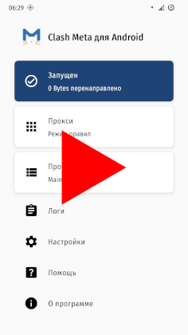
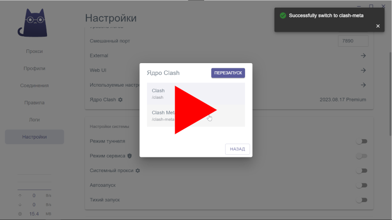

<p align="right"><a href="README.md">English</a> | Русский</p>

## Clash Meta

### Android

Рекомендуемое приложение: [Clash Meta for Android](https://github.com/MetaCubeX/ClashMetaForAndroid)


#### Установка

<!--
Рекомендую устанавливать с помощью [F-Droid](https://f-droid.org) / [Neo Store](https://f-droid.org/packages/com.machiav3lli.fdroid) — это упростит обновления. Можно установить и вручную.

- [Clash Meta для установки с помощью F-Droid / Neo Store](https://f-droid.org/packages/com.github.metacubex.clash.meta)
- [Clash Meta для установки вручную](https://fossdroid.com/a/clashmetaforandroid.apk)
-->

Clash Meta пока может быть установлен только вручную из [apk](https://github.com/MetaCubeX/ClashMetaForAndroid/releases/download/v2.9.0/cmfa-2.9.0-meta-universal-release.apk).

См. [net4people/bbs/issues/303](https://github.com/net4people/bbs/issues/303) о причинах.

#### Настройка

Вам понадобится файл конфигурации, примером может послужить [clash.meta.example.yml](clash.meta.example.yml).

Видео, ⏱️ 90 сек.:

[](https://youtu.be/VVmbiWdpNOA)


- Откройте приложение Clash Meta

- Нажмите *Профиль* → *+* (плюс) → *Файл*

- При желании измените название профиля в поле *Название*

- Нажмите *Обзор файлов* → ⋮ (3 вертикальные точки) → *Импорт* → выберите ваш файл конфигурации → ← (Назад) → 💾 (Сохранить)

- Нажмите на созданный профиль, чтобы сделать его активным

- Вернитесь на главный экран приложения кнопкой Назад

- В настройках приложения: *Настройки* → *Приложение*, включите *Автоматический перезапуск*, опционально можно также отключить счётчик трафика: *Показывать трафик*

- В настройках приложения: *Настройки* → *Сеть*, отключите разрешение приложениям обходить VPN: *Разрешить обход*, опционально отключите *Системный прокси*

- Вернитесь на главный экран приложения кнопкой Назад

- Включите Clash, нажав на кнопку *Остановлен (Нажмите для запуска)*

  Система предупредит о новом VPN подключении, согласитесь.

  Рекомендую сделать это VPN подключение постоянным в настройках системы: *Настройки* → *Сеть и интернет* → *VPN* → *Clash Meta* → ⚙ (Шестерёнка) → *Постоянная VPN*.

  Также необходимо отключить частный DNS-сервер, он мешает Clash Meta распознавать запрашиваемые домены: *Настройки* → *Сеть и интернет* → *Частный DNS-сервер* → *Отключен*. В файле конфигурации Clash Meta и так используется аналогичный DNS с шифрованием.

  При желании можно отключить постоянное уведомление о статусе Clash Meta: долгий тап по уведомлению → ⚙ (Шестерёнка) → *Статус Clash*


### Windows

Рекомендуемое приложение: [Clash Verge](https://github.com/zzzgydi/clash-verge)


#### Установка

Рекомендую устанавливать с помощью [Chocolatey](https://youtu.be/PgOn4WEDhz0) — это упростит обновления. Можно установить и вручную.

- Установка Clash Verge с помощью Chocolatey ([видео](https://youtu.be/Tt87QCcaNLM), ⏱️ 50 сек.):

  - Откройте терминал от имени администратора, выполните команду:

    ```pwsh
    choco install clash -y
    ```

- Установка Clash Verge вручную: скачайте [Clash.Verge...setup.exe](https://github.com/zzzgydi/clash-verge/releases/latest), запустите скачанный файл, установите.


#### Настройка

Вам понадобится файл конфигурации, примером может послужить [clash.meta.example.yml](clash.meta.example.yml).

Видео, ⏱️ 45 сек.:

[](https://youtu.be/0bvfWYXqRTQ)

- Откройте приложение Clash Verge

- Перейдите в настройки, нажав *Settings* в панели слева

  - Смените язык интерфейса: *Language* → *Русский*

  - *Ядро Clash* → *Clash Meta* → *Назад*

  - Включите:

    - *Системный прокси*

    - *Автозапуск*

    - *Тихий запуск* (без открытия окна)

- Перейдите в раздел *Профили* в панели слева

  - Создайте новый профиль, нажав *Новый*

    - *Тип*: *Local*

    - При желании измените название профиля в поле *Название*

    - *Выбрать файл* → выберите ваш файл конфигурации → *Открыть* → *Сохранить*

  - Нажмите на созданный профиль, чтобы сделать его активным
